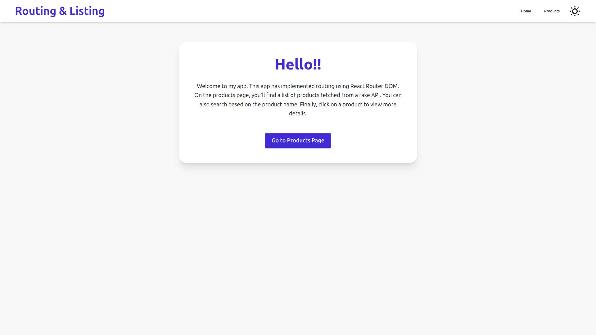
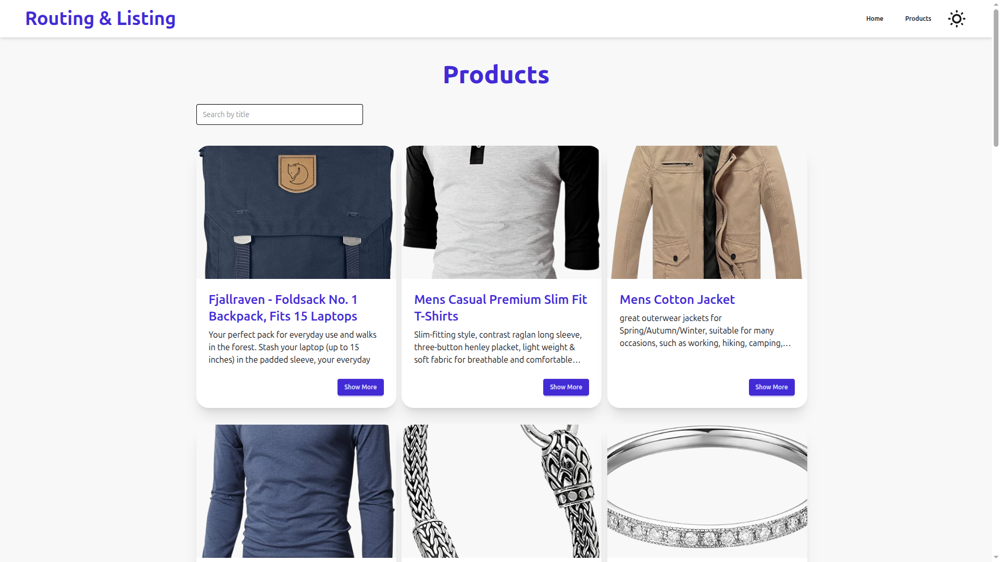
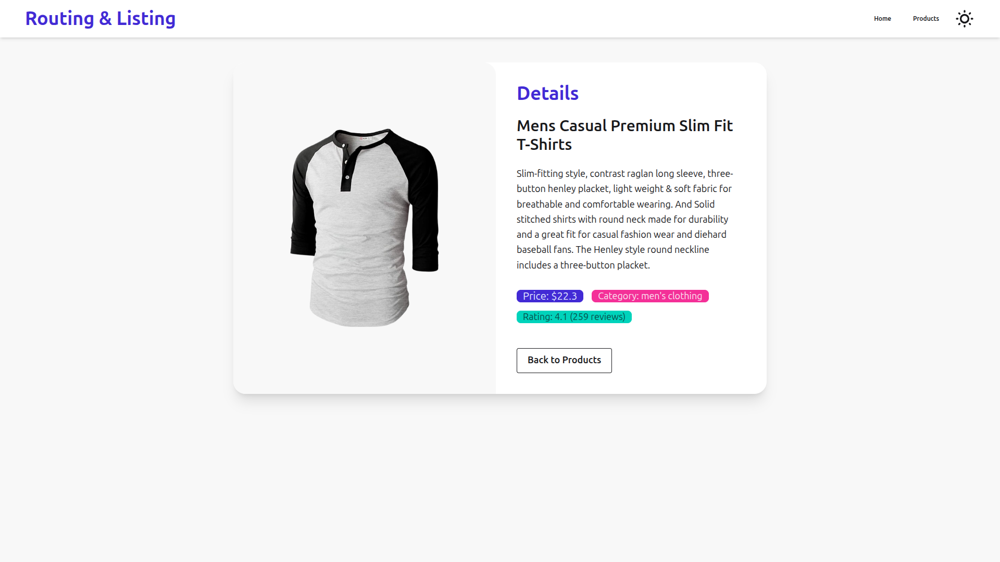

# Routing and Listing App

## Overview

This project is a React application demonstrating **React Router DOM for routing** and **product listing** with real-time search functionality. Users can:

- Navigate between **Home** and **Products** pages
- View a list of products fetched from a **fake API**
- Search products by name
- Click on a product to see **detailed information**
- Fully responsive UI styled with **Tailwind CSS & DaisyUI**

## Features

- **Routing:** Implemented with React Router DOM
- **Product Listing:** Grid layout showing product cards
- **Product Details:** Individual product page with description, price, category, and rating
- **Search Filtering:** Real-time search for products by title
- **Themeable UI:** Uses DaisyUI semantic colors for consistency

## Installation & Running the Project

```bash
# Clone the repository
git clone https://github.com/Raman-X/LaunchpadTasks.git

# Navigate to the app folder
cd LaunchpadTasks/task12-routing&listing

# Install dependencies
npm install

# Run development server
npm run dev   # (if using Vite)
# or
npm start     # (if using CRA)
```




