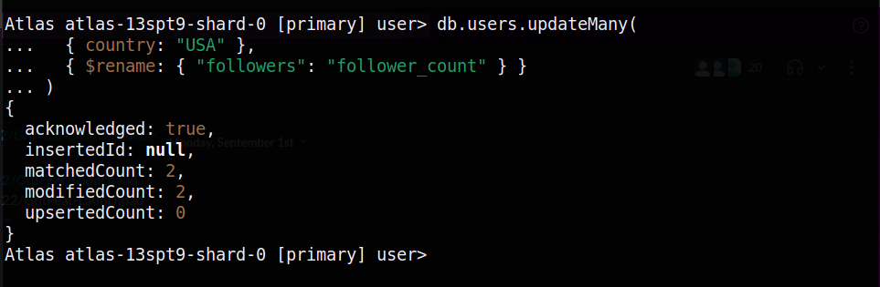

# MongoDB Assignment

## Find Queries

### 1. Find users older than 30, but only show their username and country.

```js
db.users.find({ age: { $gt: 30 } }, { username: 1, country: 1, _id: 0 });
```


### 2. Find users whose follower count is less than or equal to 100.

```js
db.users.find({ followers: { $lte: 100 } });
```


### 3. Find all users from 'USA' or 'Canada'.

```js
db.users.find({ country: { $in: ["USA", "Canada"] } });
```


### 4. Find all users who are NOT from 'USA' or the 'UK'.

```js
db.users.find({ country: { $nin: ["USA", "UK"] } });
```


### 5. Find users who are from the 'USA' AND have more than 1000 followers.

```js
db.users.find({
  country: "USA",
  followers: { $gt: 1000 },
});
```


### 6. Find users who have more than 2000 followers OR are from 'Australia'.

```js
db.users.find({
  $or: [{ followers: { $gt: 2000 } }, { country: "Australia" }],
});
```


### 7. Find all users who have a subscription field.

```js
db.users.find({ subscription: { $exists: true } });
```


### 8. Find users whose profile field is a string, not an embedded document.

```js
db.users.find({ profile: { $type: "string" } });
```


### 9. Find users who are interested in both 'travel' AND 'music'.

```js
db.users.find({
  interests: { $all: ["travel", "music"] },
});
```


### 10. Find users who have used a 'mobile' device since October 1st, 2023.

```js
db.users.find({
  "devices.type": "mobile",
  "devices.last_seen": { $gte: ISODate("2023-10-01T00:00:00Z") },
});
```


### 11. Find all users whose email address ends with 'workplace.com'.

```js
db.users.find({ email: /workplace\.com$/ });
```


### 12. Find users from the 'USA' who are either younger than 25 OR have more than 1500 followers.

```js
db.users.find({
  country: "USA",
  $or: [{ age: { $lt: 25 } }, { followers: { $gt: 1500 } }],
});
```


### 13. Find all users who have a 'desktop' device that runs 'Windows'.

```js
db.users.find({
  devices: {
    $elemMatch: {
      type: "desktop",
      os: "Windows",
    },
  },
});
```


## Update Queries

### 14. For user sam_g, add 50 followers and add a new interest 'coding'.

```js
db.users.updateOne(
  { username: "sam_g" },
  {
    $inc: { followers: 50 },
    $addToSet: { interests: "coding" },
  }
);
```


### 15. For all users from the 'USA', rename the followers field to follower_count.

```js db.users.updateMany(
  { country: "USA" },
  { $rename: { "followers": "follower_count" } }
)
```



### 16. Attempt to update user new_user; if they don't exist, insert them with default data.

```js
db.users.updateOne(
  { username: "new_user" },
  {
    $setOnInsert: {
      username: "new_user",
      email: "new_user@example.com",
      age: 25,
      country: "Unknown",
      followers: 0,
      interests: [],
      profile: { theme: "light", bio: "New user" },
    },
  },
  { upsert: true }
);
```


### 17. Update all users with a 'dark' theme profile by adding a pro_user: true flag.

```js
db.users.updateMany({ "profile.theme": "dark" }, { $set: { pro_user: true } });
```


## Delete Queries

### 18. Delete all users who have not logged in (hint: the last_login field does not exist).

```js
db.users.deleteMany({ last_login: { $exists: false } });
```


