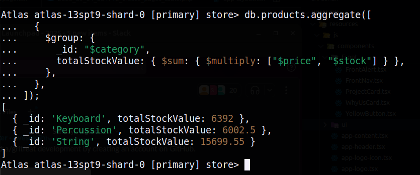
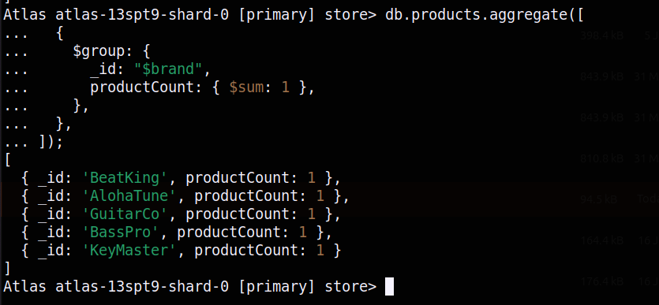
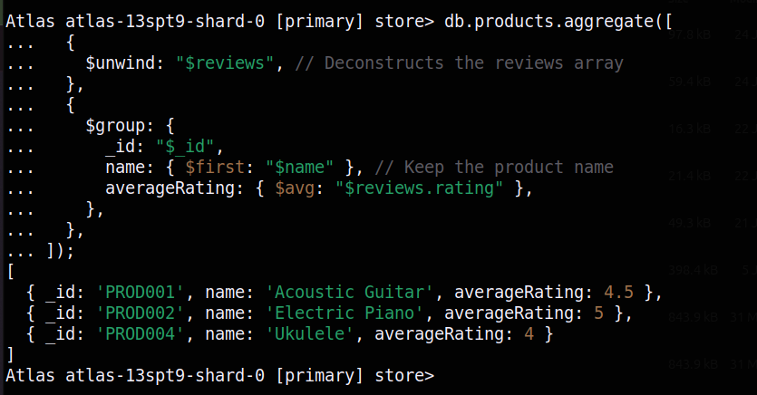
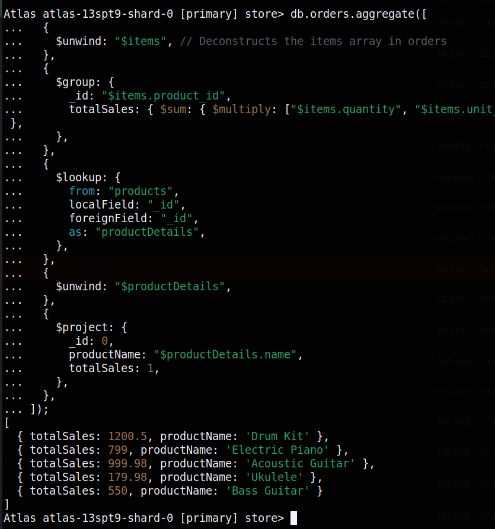
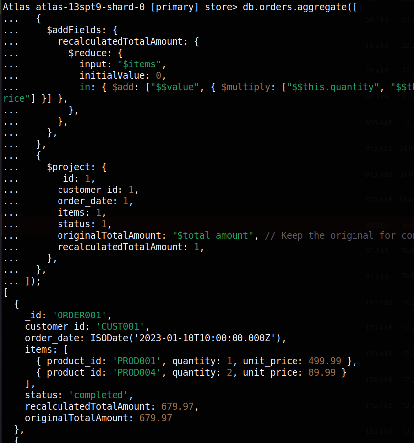
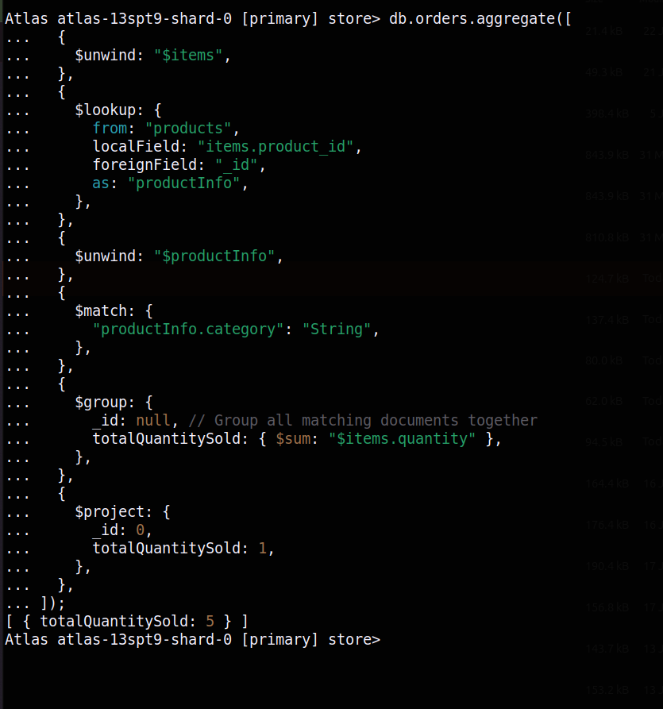
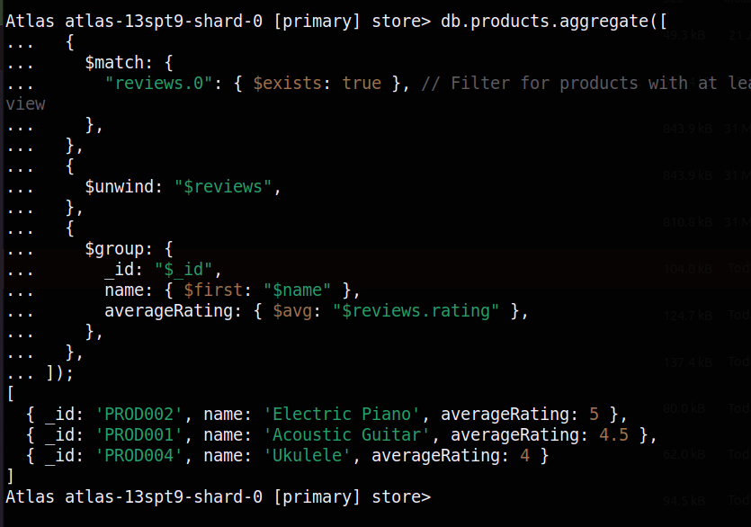
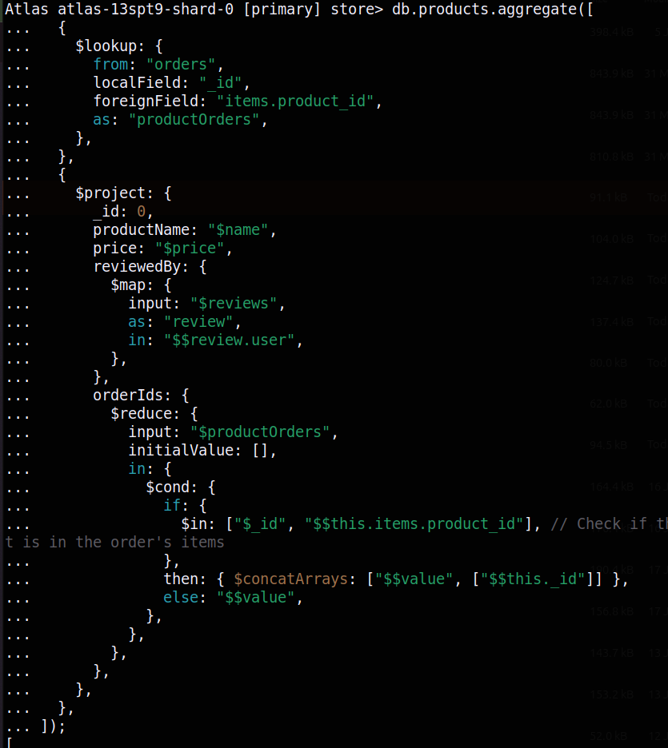
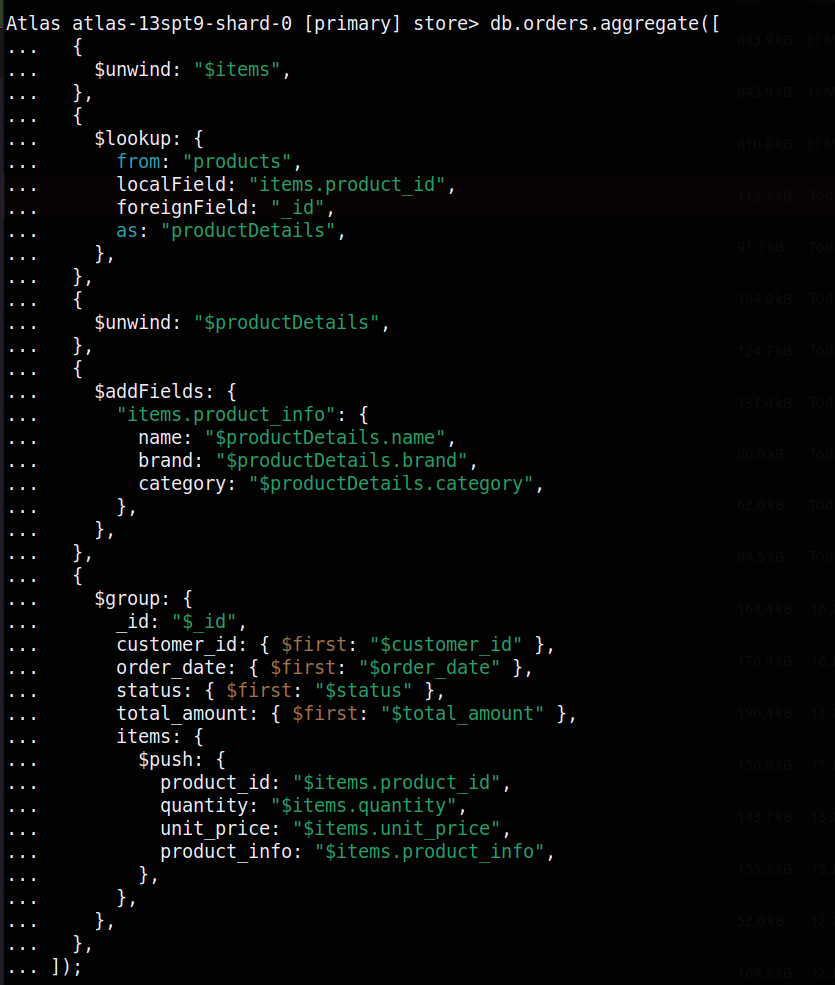
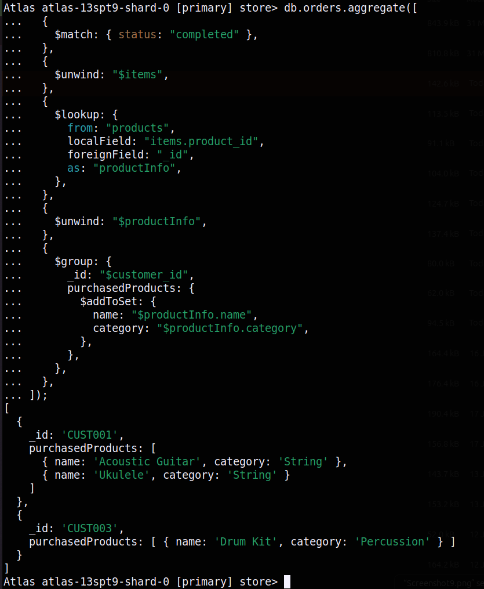

# MongoDB Assignment

## Find Queries

### 1. Calculate Total Stock Value by Category.

```js
db.products.aggregate([
  {
    $group: {
      _id: "$category",
      totalStockValue: { $sum: { $multiply: ["$price", "$stock"] } },
    },
  },
]);
```



### 2. Count Products per Brand.

```js
db.products.aggregate([
  {
    $group: {
      _id: "$brand",
      productCount: { $sum: 1 },
    },
  },
]);
```



### 3. Find the Average Rating for Each Product.

```js
db.products.aggregate([
  {
    $unwind: "$reviews",
  },
  {
    $group: {
      _id: "$_id",
      name: { $first: "$name" },
      averageRating: { $avg: "$reviews.rating" },
    },
  },
]);
```



### 4. Calculate Total Sales for Each Product.

```js
db.orders.aggregate([
  {
    $unwind: "$items",
  },
  {
    $group: {
      _id: "$items.product_id",
      totalSales: {
        $sum: { $multiply: ["$items.quantity", "$items.unit_price"] },
      },
    },
  },
  {
    $lookup: {
      from: "products",
      localField: "_id",
      foreignField: "_id",
      as: "productDetails",
    },
  },
  {
    $unwind: "$productDetails",
  },
  {
    $project: {
      _id: 0,
      productName: "$productDetails.name",
      totalSales: 1,
    },
  },
]);
```



### 5. Recalculate each order's total amount using $reduce.

```js
db.orders.aggregate([
  {
    $addFields: {
      recalculatedTotalAmount: {
        $reduce: {
          input: "$items",
          initialValue: 0,
          in: {
            $add: [
              "$$value",
              { $multiply: ["$$this.quantity", "$$this.unit_price"] },
            ],
          },
        },
      },
    },
  },
  {
    $project: {
      _id: 1,
      customer_id: 1,
      order_date: 1,
      items: 1,
      status: 1,
      originalTotalAmount: "$total_amount",
      recalculatedTotalAmount: 1,
    },
  },
]);
```



### 6. Find the total quantity of 'String' products sold.

```js
db.orders.aggregate([
  {
    $unwind: "$items",
  },
  {
    $lookup: {
      from: "products",
      localField: "items.product_id",
      foreignField: "_id",
      as: "productInfo",
    },
  },
  {
    $unwind: "$productInfo",
  },
  {
    $match: {
      "productInfo.category": "String",
    },
  },
  {
    $group: {
      _id: null,
      totalQuantitySold: { $sum: "$items.quantity" },
    },
  },
  {
    $project: {
      _id: 0,
      totalQuantitySold: 1,
    },
  },
]);
```



### 7. Find the average rating for each product that has received at least one review.

```js
db.products.aggregate([
  {
    $match: {
      "reviews.0": { $exists: true },
    },
  },
  {
    $unwind: "$reviews",
  },
  {
    $group: {
      _id: "$_id",
      name: { $first: "$name" },
      averageRating: { $avg: "$reviews.rating" },
    },
  },
]);
```



### 8. For each product, create a summary that includes its name and price, a simple list of the usernames who reviewed it, and a list of the order IDs in which it was sold.

```js
db.products.aggregate([
  {
    $lookup: {
      from: "orders",
      localField: "_id",
      foreignField: "items.product_id",
      as: "productOrders",
    },
  },
  {
    $project: {
      _id: 0,
      productName: "$name",
      price: "$price",
      reviewedBy: {
        $map: {
          input: "$reviews",
          as: "review",
          in: "$$review.user",
        },
      },
      orderIds: {
        $reduce: {
          input: "$productOrders",
          initialValue: [],
          in: {
            $cond: {
              if: {
                $in: ["$_id", "$$this.items.product_id"],
              },
              then: { $concatArrays: ["$$value", ["$$this._id"]] },
              else: "$$value",
            },
          },
        },
      },
    },
  },
]);
```



### 9. Retrieve a list of all orders, but instead of just showing product IDs in the items array, replace them with a more detailed object containing the product's name, brand, and category.

```js
db.orders.aggregate([
  {
    $unwind: "$items",
  },
  {
    $lookup: {
      from: "products",
      localField: "items.product_id",
      foreignField: "_id",
      as: "productDetails",
    },
  },
  {
    $unwind: "$productDetails",
  },
  {
    $addFields: {
      "items.product_info": {
        name: "$productDetails.name",
        brand: "$productDetails.brand",
        category: "$productDetails.category",
      },
    },
  },
  {
    $group: {
      _id: "$_id",
      customer_id: { $first: "$customer_id" },
      order_date: { $first: "$order_date" },
      status: { $first: "$status" },
      total_amount: { $first: "$total_amount" },
      items: {
        $push: {
          product_id: "$items.product_id",
          quantity: "$items.quantity",
          unit_price: "$items.unit_price",
          product_info: "$items.product_info",
        },
      },
    },
  },
]);
```



### 10. Create a profile for each customer showing a list of products they have purchased. The list should not contain duplicates and should include the product name and category.

```js
db.orders.aggregate([
  {
    $match: { status: "completed" },
  },
  {
    $unwind: "$items",
  },
  {
    $lookup: {
      from: "products",
      localField: "items.product_id",
      foreignField: "_id",
      as: "productInfo",
    },
  },
  {
    $unwind: "$productInfo",
  },
  {
    $group: {
      _id: "$customer_id",
      purchasedProducts: {
        $addToSet: {
          name: "$productInfo.name",
          category: "$productInfo.category",
        },
      },
    },
  },
]);
```


